# LANGKAH - LANGKAH PRATIKUM

### 1. Membuat Halaman Html

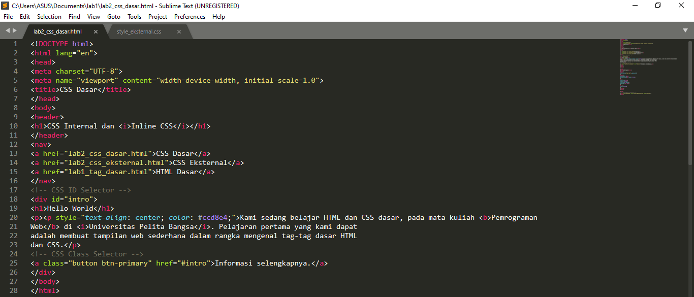

Buka pada chrome lalu liat hasilnya

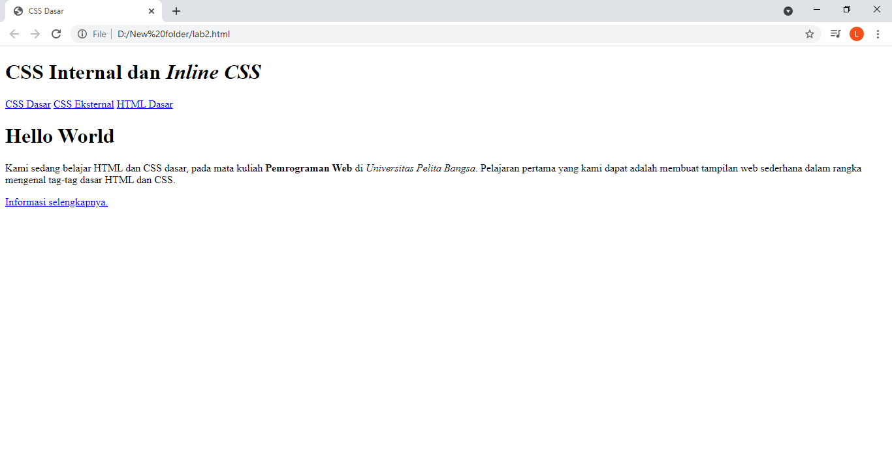

### 2. Mendeklarasikan CSS Internal

Tambahkan deklarasi css internal pada bagian head

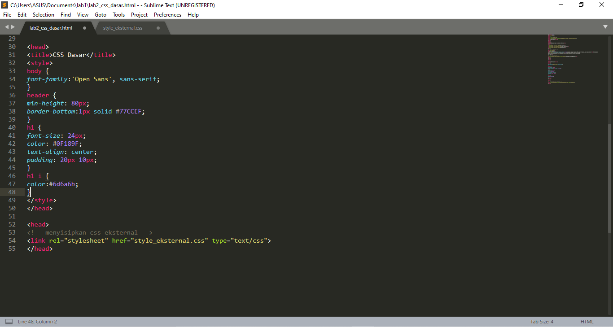

Refreh chrome dan liat hasilnya

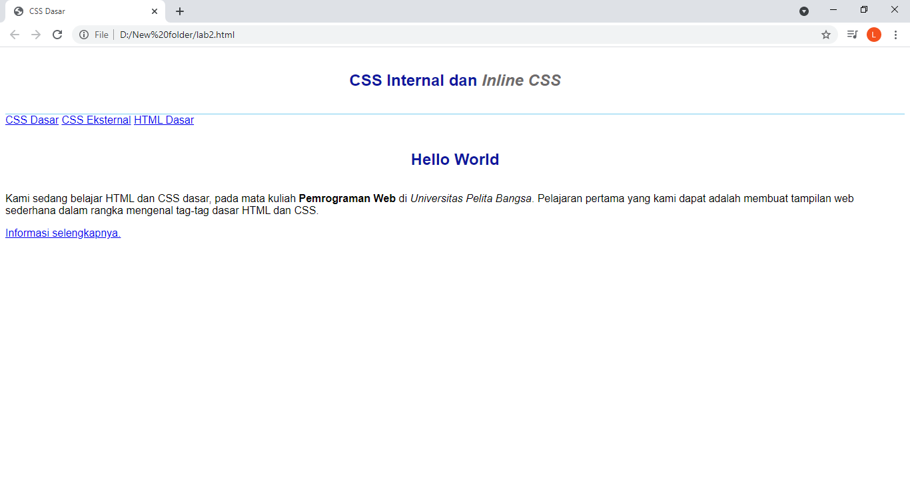

### 3. Menambahkan Inline CSS

Tambahkan inline css pada tag "p"
  
 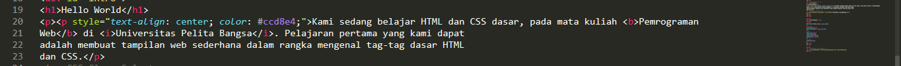
 
 Refresh chrome dan liat hasilnya
 
 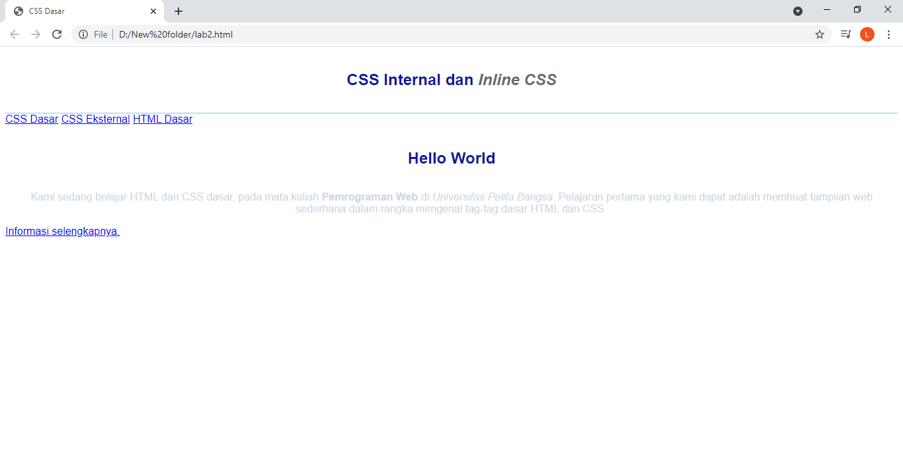
 
 ### 4. Membuat CSS Internal
 
 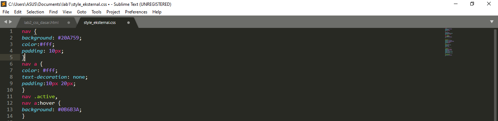
 
 tambahkan tag <link> untuk merujuk file css yang sudah dibuat pada bagian "head"
  
  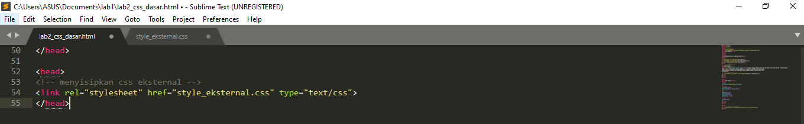
  
  Refresh chrome dan liat hasilnya
  
  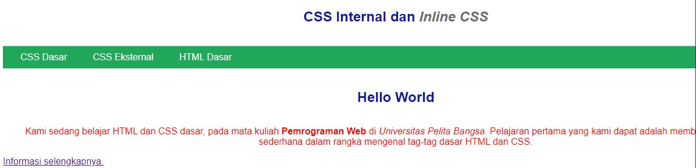
  
  ### 5. Menambahkan CSS Selektor
  
  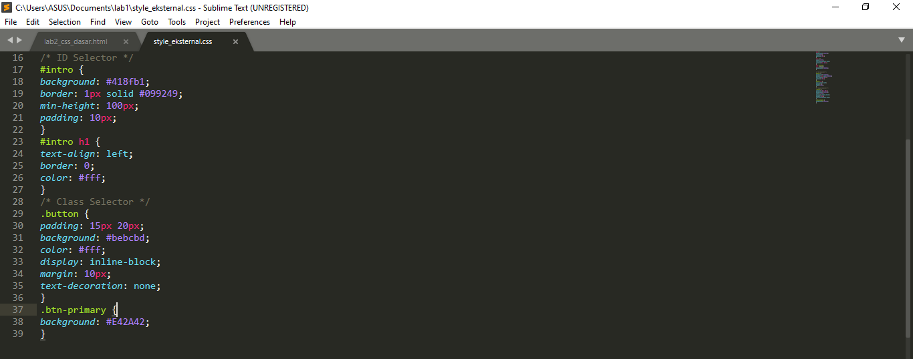
  
  Refresh chrome dan liat hasilnya
  
  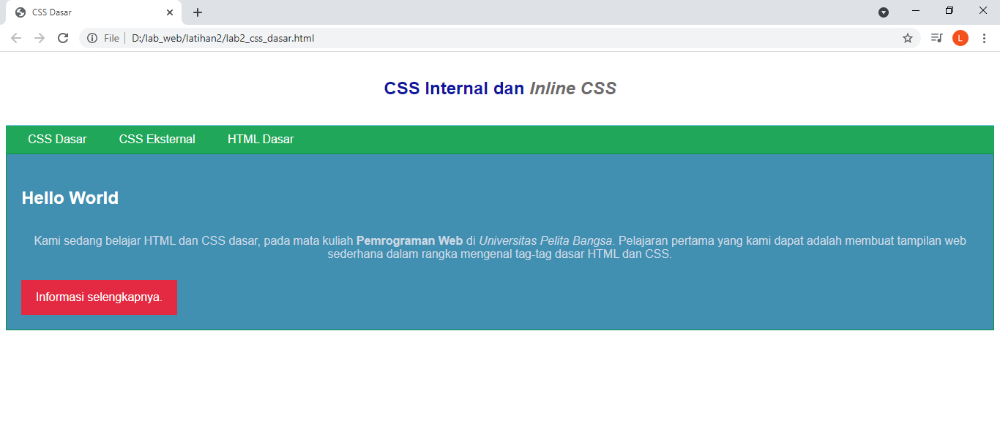
  
  

